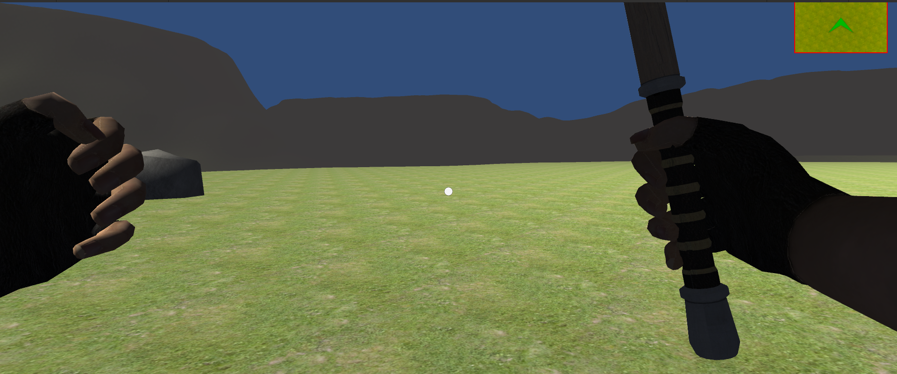

# First Person Player For Unity

A First Person Player for RPG Game made by help of [Brackeys](https://www.youtube.com/c/Brackeys)'s YT tutorials.

- [x] Locomotion
- [x] Jump
- [x] Head Bobbing
- [x] Four Weapon Attached
- [x] Switching Weapon with keypad and mouse
- [x] Mini Map
- [x] A Demo Scene
- [x] Walking Audio 
- [x] Camera Shake

## 

## License:
Read [this](https://devassets.com/guidelines/) for Survival Game Asset.
You can use it anywhere but it do not give you any gurrenty that it will works or perfectly or do not damage anything like faulty program etc.It has contain third parties asset which are belong to their License.

## Credits :
1. [Unity Tutorials,Adding Arms - Create Survival Game by Bracky ](https://www.youtube.com/watch?v=OUQuHf8M9XQ)
2. [First Person Movement](https://www.youtube.com/watch?v=_QajrabyTJc)
3. [Survival Game Asset](https://devassets.com/assets/survival-game-assets/)
4. [Unity Standard Asset Character](https://github.com/Unity-Technologies/Standard-Assets-Characters)

## Unity Version
Unity 2020.3.15f2 or higher version.

