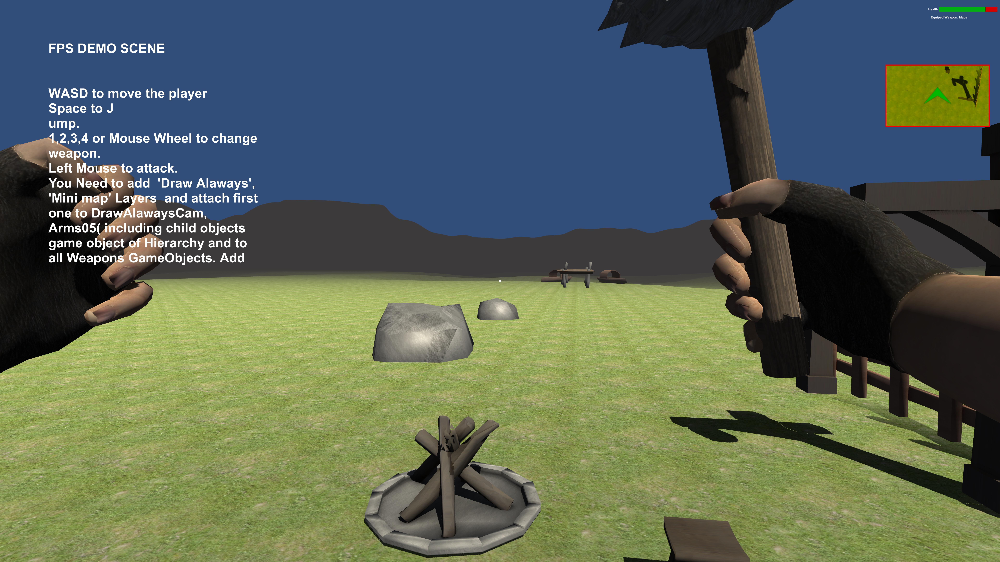
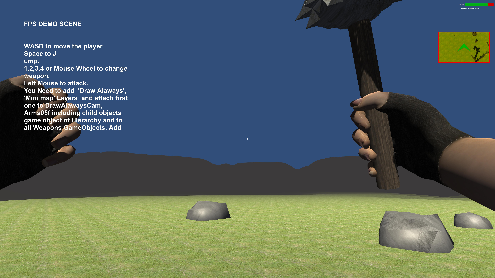
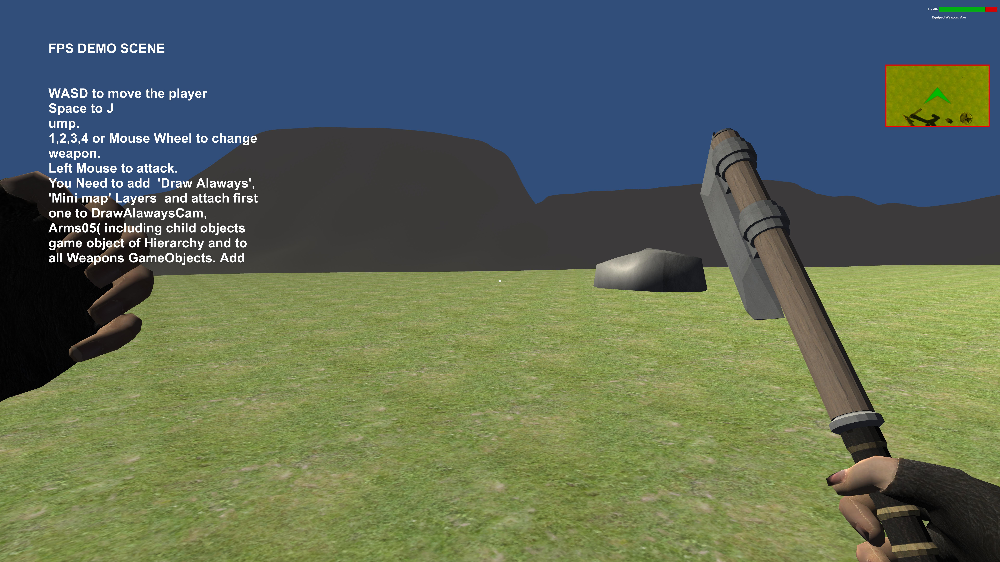

# First Person Player For Unity

A First Person Player for RPG Game made by help of [Brackeys](https://www.youtube.com/c/Brackeys)'s YT tutorials.

It has roughly following Characteristics:

- [x] Locomotion
- [x] Jump
- [x] Head Bobbing
- [x] Six Weapon Attached
- [x] Switching Weapon with keypad and mouse
- [x] Mini Map
- [x] A Demo Scene
- [x] Walking Audio 
- [x] Camera Shake

## 
## 
## 

## Doc :
This is complete Unity Project if You download this project and open it then it will works perfectly.
If you use this project with your old project then first put 'Asset' folder in your project.
Create two Layers 1. Draw Alaways 2. Mini map and then Change the layers of 'DrawAlawaysCam' and 'Arms05(including childrens of it)' Which will help to see the player hand by Draw AlawaysCam Camera.
Change the layers of Minimap (including Childrens of it) otherwise Minimap would not works perfectly.
You also need to select GroundChec from PlayerMovement Script which is attached to the FPS_Player prefab.
Now you can use FPS_Player prefab in your project.
## License:
Read [this](https://devassets.com/guidelines/) for Survival Game Asset.
You can use it anywhere but it do not give you any gurrenty that it will works perfectly or do not damage anything like faulty program etc.It has contain third party asset which are belong to their License.

## Credits :
1. [Unity Tutorials,Adding Arms - Create Survival Game by Bracky ](https://www.youtube.com/watch?v=OUQuHf8M9XQ)
2. [First Person Movement](https://www.youtube.com/watch?v=_QajrabyTJc)
3. [Survival Game Asset](https://devassets.com/assets/survival-game-assets/)
4. [Unity Standard Asset Character](https://github.com/Unity-Technologies/Standard-Assets-Characters)

## Unity Version
Unity 2020.3.15f2 or higher version.

## Contact

